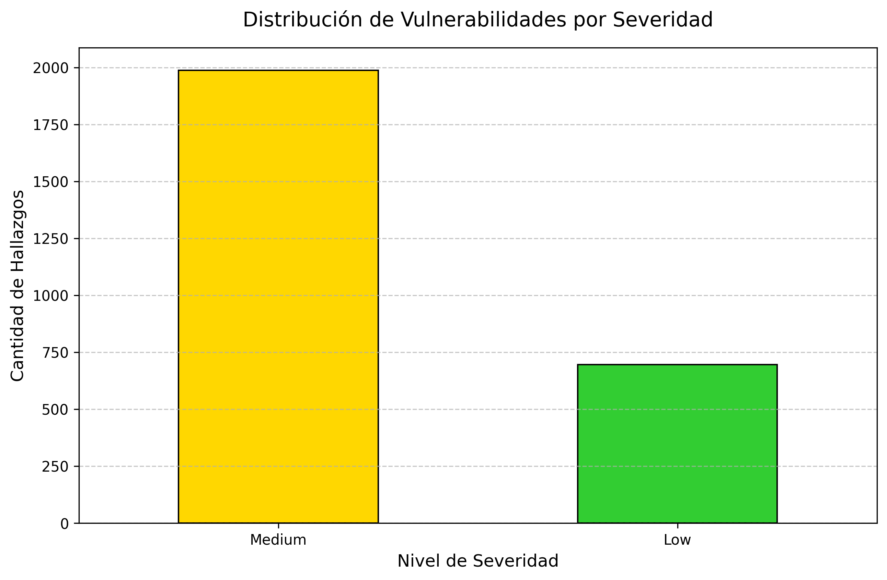
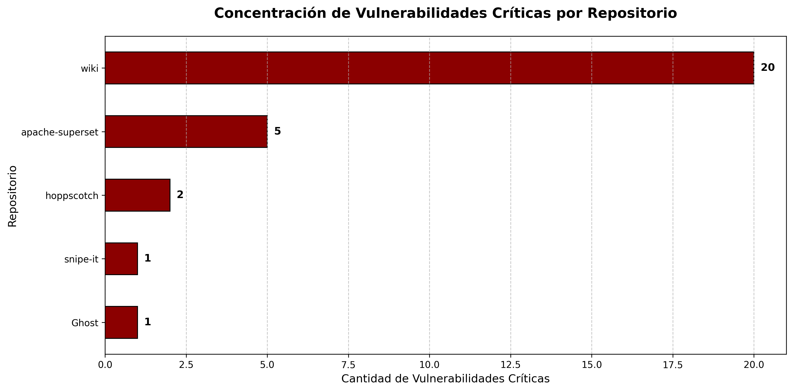

# Propuesta de Gestión de Vulnerabilidades en la Cadena de Suministro

## 1. Contexto del análisis

En el presente trabajo se evaluó la seguridad de la cadena de suministro de software de una selección de 9 repositorios Open Source: **Ghost, Apache Superset, Gitea, Hoppscotch, LibreNMS, Mastodon, Snipe-IT, Wiki.js y ZoneMinder**. Estos repositorios fueron seleccionados por la variedad de tecnologías (Go/Node/PHP/Ruby/Python/C++).

El proceso de auditoría cubrió múltiples dimensiones del ciclo de vida del desarrollo:
- Generación de SBOMs (Software Bill of Materials) mediante Syft.
- Análisis de vulnerabilidades en dependencias (SCA) con Grype.
- Escaneo estático de código fuente (SAST) con CodeQL.
- Auditoría de postura de seguridad y configuraciones de pipelines de CI/CD (GitHub Actions).

Dada la alta volumetría de datos generada, el objetivo de este documento es proponer un modelo de gestión integral. En las siguientes secciones se aplica un análisis estructurado sobre una muestra representativa de hallazgos críticos, permitiendo priorizar el riesgo y tomar decisiones de mitigación basadas en evidencia.

## 2. Vulnerabilidades encontradas

En total se identificaron 2740 vulnerabilidades, distribuidas en 29 críticas, 316 altas, 2303 medias y 92 bajas. 

La concentración de hallazgos críticos se ubica principalmente en el repositorio wiki (20) con afectaciones en múltiples dependencias, seguido por apache-superset (5) debido a la presencia repetida de la librería vm2, hoppscotch (2), y de manera aislada en snipe-it (1) y Ghost (1).

## 3. Clasificación según vector de ataque

Las vulnerabilidades y hallazgos identificados se agrupan en los tres vectores de ataque principales definidos para la gestión de este análisis:

- **Vector 1: Dependencias y código fuente:** Vulnerabilidades integradas directamente en el artefacto de software. Incluye inyecciones SQL en repositorios como Gitea y ejecución de código arbitrario en librerías de terceros (ej. `underscore` en el proyecto Wiki.js).
- **Vector 2: Pipelines de CI/CD:** Riesgos en la infraestructura de automatización. Destacan la exposición de secretos en texto claro dentro de scripts y el uso inseguro de GitHub Actions mediante "tags mutables" combinados con permisos excesivos por defecto.
- **Vector 3: Humanos:** Deficiencias en la gobernanza y prácticas del equipo. Se evidencia por la carencia de revisión obligatoria de código (ausencia de archivos `CODEOWNERS`) y la falta de automatización para el parcheo de dependencias de forma continua.

## 4. Análisis usando el ciclo Conozco → Verifico → Evidencio → Decido y Actúo

A continuación, se desarrolla el ciclo de gestión para una muestra representativa de vulnerabilidades críticas que abarcan los tres vectores estudiados.

### Análisis 1: Inyección de Secretos en Pipeline de Wiki.js (Vector 2: Pipelines)

- **Conozco:** La auditoría manual de los flujos de GitHub Actions reveló un riesgo crítico en el repositorio `wiki` (hallazgo C-1). Se utiliza un secreto (`HELM_REPO_PASSWORD`) directamente dentro de un script de shell en el pipeline de despliegue.
- **Verifico:** Inyectar secretos directamente en línea dentro de un comando `run:` es altamente inseguro. Si el comando falla o si el entorno es manipulado, GitHub Actions podría imprimir el secreto en los logs públicos, comprometiendo los accesos al registro de Helm.
- **Evidencio:** El archivo `.github/workflows/helm.yml` (línea 26) contiene el comando: `--password="${{secrets.HELM_REPO_PASSWORD}}"`. Screenshot en `/evidence/capturas/helm_wiki.png`
- **Decido y Actúo:**
  - *Decisión:* La exposición potencial de credenciales de infraestructura representa un riesgo crítico de cadena de suministro y debe subsanarse inmediatamente.
  - *Acción:* Modificar el workflow para que el secreto se asigne a una variable de entorno segura en el bloque `env:`, invocando la variable dentro del script de bash sin interpolación directa.

### Análisis 2: Ejecución Ciega de Binarios y Permisos Excesivos en Hoppscotch (Vector 2: Pipelines)

- **Conozco:** La auditoría manual de los flujos de GitHub Actions en `hoppscotch` (archivo `build-hoppscotch-agent.yml`) reveló vulnerabilidades críticas de envenenamiento de cadena de suministro. Existe ausencia total del bloque global de permisos y se realiza la descarga de dependencias binarias externas sin validación de integridad.
- **Verifico:** Por un lado, las acciones de terceros utilizan tags mutables (`@v1` o `@v3`), asumiendo permisos amplios por defecto. Por otro lado, en múltiples *steps* de preparación (ej. instalación de `cargo-tauri` o `trunk`), el pipeline utiliza comandos `curl` para descargar archivos comprimidos de repositorios de terceros, los cuales son desempaquetados y ejecutados (`chmod +x`) sin verificar previamente su checksum (SHA256). Si el release de origen es alterado por un atacante, el pipeline ejecutaría código malicioso, exponiendo todos los secretos de firma criptográfica (Apple y Azure) inyectados en el entorno.
- **Evidencio:** Archivo `.github/workflows/build-hoppscotch-agent.yml` (líneas 58-64 y 222-228), donde se descarga y ejecuta código de `github.com/tauri-apps` sin comandos de verificación de hash previos. Adicionalmente, el workflow carece del bloque `permissions:`.
- **Decido y Actúo:**
  - *Decisión:* La inyección de código de terceros no validado durante el proceso de *build* compromete absolutamente la integridad de los artefactos generados. Es un riesgo inaceptable.
  - *Acción: 1* Modificar los scripts de bash para que, tras el comando `curl`, se exija la validación del hash del archivo descargado (ej. mediante `sha256sum -c`) contra un hash duro almacenado de forma segura en el repositorio.
  - *Acción: 2* Declarar `permissions: contents: read` a nivel global en el YAML.
  - *Acción: 3* Fijar las GitHub Actions a hashes SHA inmutables (`@<SHA-completo>`). Para mitigar el impacto en el mantenimiento y evitar que el pipeline quede obsoleto (deuda técnica), se debe integrar esta medida obligatoriamente con una herramienta de gestión de dependencias como Dependabot o Renovate, la cual automatice la actualización de dichos hashes.

### Análisis 3: Ejecución de Código Arbitrario en Wiki.js (Vector 1: Dependencias)

- **Conozco:** A través del escaneo SCA (Grype), se detectó una vulnerabilidad crítica de Ejecución de Código Arbitrario (ACE) en la dependencia `underscore` utilizada en el repositorio `wiki`.
- **Verifico:** El fallo afecta a las versiones `1.6.0`, `1.8.3` y `1.9.1` de la librería `underscore`. Un atacante podría aprovechar este vector si el software expone funciones de evaluación u objetos sin control a entradas externas.
- **Evidencio:** El reporte SCA vincula estas versiones al identificador `GHSA-cf4h-3jhx-xvhq` con una severidad "Critical".
- **Decido y Actúo:**
  - *Decisión:* Las vulnerabilidades en componentes críticos que permiten la escritura de archivos fuera del directorio de destino (`tar`) y la ejecución de código arbitrario (`underscore`) representan un riesgo de compromiso total del servidor.
  - *Acción:* Además de actualizar `underscore`, es imperativo auditar las funciones de extracción de archivos en Wiki.js para implementar restricciones de rutas (path sanitization), bloqueando explícitamente ataques de Zip Slip o Hardlink Traversal.

### Análisis 4: Escape de Sandbox en Apache Superset (Vector 1: Dependencias)
- **Conozco:** Múltiples vulnerabilidades críticas en la librería `vm2` (ej. `GHSA-m4wx-m65x-ghrr`).
- **Verifico:** `vm2` es el motor de aislamiento de Superset para código JavaScript. Los CVEs reportados indican un escape de sandbox que permite a un usuario no privilegiado ejecutar código arbitrario en el sistema host.
- **Evidencio:** El reporte `resumen_vulnerabilidades.csv` lista 5 instancias críticas de `vm2` (más 3 High, 1 Medium y 1 Low, todas en vm2 @ 3.11.3).
- **Decido y Actúo:** 
  - *Acción:* Dado que `vm2` es una dependencia central de seguridad, la remediación no puede ser solo un `npm update`. Se requiere una evaluación de arquitectura para migrar a un entorno de ejecución más seguro (como Worker Threads con restricciones de sistema operativo o entornos Isolate más robustos) si la librería sigue presentando fallos de diseño fundamentales.

### Análisis 5: Inyección SQL en Gitea (Vector 1: Código Fuente)

- **Conozco:** CodeQL reportó una vulnerabilidad de inyección SQL en el código fuente del repositorio Gitea. El archivo afectado es `models/issues/milestone_list.go` .
- **Verifico:** Se revisa el reporte SAST y el código fuente. Aunque la herramienta lo clasifica genéricamente como inyección SQL, se verifica que el ORM protege contra inyecciones clásicas (SQLi) mediante sentencias preparadas. No obstante, se confirma que el framework pasa la entrada del usuario a una cláusula `LIKE` sin escapar, y se detecta una omisión en la cadena de métodos del ORM que ignora la validación de permisos del repositorio. CodeQL detectó 2 hits de `go/sql-injection` en `milestone_list.go`.
- **Evidencio:** El archivo `resumen_vulnerabilidades.csv` detalla la regla `go/sql-injection` clasificada con severidad "Medium". Requiere parche o revisión manual. Captura de pantalla: `evidence/capturas/inyeccion_sql_gitea.png`.
- **Decido y Actúo:**
  - *Decisión:* Aunque el ORM previene inyecciones SQL tradicionales (SQLi) mediante el uso de sentencias preparadas, la entrada del usuario se pasa directamente a una cláusula `LIKE` sin sanitizar los caracteres comodín (`%`,`_`). Esto representa un riesgo de Inyección de Comodines que podría derivar en una Denegación de Servicio (DoS) por agotamiento de recursos en la base de datos.
  - *Acción:* Refactorizar la función en `milestone_list.go` (específicamente donde se usa `builder.Like`) para implementar una función de limpieza que escape explícitamente los caracteres comodín de SQL en la variable `keyword` antes de que el ORM construya la consulta. Adicionalmente, revisar la lógica de construcción de `sess` para resolver la pérdida de condiciones de acceso (posible IDOR).

### Análisis 6: Falta de Gobernanza como Causa Raíz en Wiki.js (Vector 3)

- **Conozco:** Wiki.js es el único repositorio del corpus que combina las tres carencias de gobernanza simultáneamente: sin Dependabot/Renovate, sin CODEOWNERS, y workflows sin bloque `permissions:`. En paralelo, es también el repositorio con mayor concentración de vulnerabilidades críticas SCA del estudio (20+ CVEs Critical).
- **Verifico:** Se cruza la matriz V3 del reporte_auditoria_github.md (fila `wiki`) con el conteo de severidades Critical/High del resumen_vulnerabilidades.csv filtrado por `Repositorio = wiki`. La correlación es directa: la ausencia de automatización de parches (V3.2) explica por qué versiones como `underscore@1.6.0`, `minimist@0.0.8` o `xmldom@0.1.27` —deprecadas hace años— siguen vigentes en el árbol de dependencias.
- **Evidencio:** 
  | Repo   | SECURITY.md | Dependabot | CODEOWNERS | CVEs Críticos SCA |
  |--------|:-----------:|:----------:|:----------:|:-----------------:|
  | wiki   | ✅          | ❌         | ❌         | 20+               |
  | Ghost  | ✅          | ✅         | ✅         | 1                 |
- **Decido y Actúo:** Wiki.js evidencia que la deuda técnica de seguridad no se origina 
  en los desarrolladores, sino en la AUSENCIA de mecanismos automáticos.
  - *Acciones:*
    - introducir `.github/dependabot.yml` con todos los ecosistemas (npm, github-actions).
    - establecer `CODEOWNERS` para módulos críticos como autenticación SAML (`server/modules/authentication`) y persistencia (`server/db`).
    - habilitar Branch Protection Rules que exijan revisión.

## 5. Priorización de vulnerabilidades

Para maximizar la resiliencia del software analizado minimizando el esfuerzo inicial, el equipo debe seguir el siguiente orden de remediación:

1. **Prioridad 1 (Crítica) - Integridad de la cadena de suministro (Vector 2):** Resolver la exposición de secretos en `wiki`, bloquear los permisos globales en los workflows defectuosos, y asegurar la inmutabilidad de las dependencias externas (mediante SHA pinning en Actions y validación de checksums en descargas de binarios en `hoppscotch`).
2. **Prioridad 2 (Alta) - Ejecución de código externa (Vector 1):** Actualizar componentes críticos reportados por SCA (como `underscore` y `vm2`), y mitigar las inyecciones directas en código (SAST) que permitan exfiltrar datos de bases de datos.
3. **Prioridad 3 (Media) - Postura de gobernanza (Vector 3):** Implementar Dependabot y reglas de revisión de código (`CODEOWNERS`) de manera transversal en la organización, evitando que la deuda técnica crezca a futuro.
4. **Prioridad 4 (Baja) - Fallos aislados (Vector 1):** Atender vulnerabilidades tipo ReDoS que sólo resultan en caídas de servicio a nivel cliente, o vulnerabilidades presentes únicamente en herramientas limitadas a pruebas (devDependencies).

## 6. Acciones propuestas (Plan de remediación global)

- **Refactorización de código:** Sanitizar proactivamente la entrada del usuario (por ejemplo, escapando caracteres especiales y comodines en búsquedas) y auditar la lógica del ORM para garantizar que las políticas de control de acceso y filtrado por permisos se apliquen de forma estricta e inmutable en todas las consultas.
- **Hardening de Pipelines (CI/CD):** Migrar de "tags mutables" a "commit SHA" inmutables gestionados activamente por herramientas de actualización automática para evitar deuda técnica. Requerir la validación criptográfica (checksums) de todo artefacto o binario descargado durante el build, y mover la gestión de contraseñas de línea de comandos a inyección segura de variables de entorno.
- **Políticas Organizacionales e Ingeniería Humana:** Instaurar archivos `.github/dependabot.yml` y `CODEOWNERS` como requerimientos estándar para todos los repositorios productivos.

## 7. Evidencia utilizada

Toda la propuesta está debidamente respaldada por los artefactos recopilados, ubicados en los directorios del repositorio de la siguiente forma:

- `results/`: Contiene los archivos crudos generados en formato JSON y SARIF resultantes del paso de Syft, Grype y CodeQL por cada repositorio.
- `evidence/capturas/distribucion_severidad.png`: Gráfico generador a partir del archivo `evidence/reportes/resumen_vulnerabilidades.csv` que muestra la distribución de vulnerabilidades según su severidad.
- `evidence/capturas/helm_wiki.png`: Captura de pantalla del archivo `.github/workflows/helm.yml` que muestra el uso de un secreto directamente dentro de un script de shell en el pipeline de despliegue.
- `evidence/capturas/inyeccion_sql_gitea.png`: Captura de pantalla del archivo `gitea/models/issues/milestone_list.go` que muestra la lógica de construcción de la consulta SQL con parámetros dinámicos.
- `evidence/reportes/resumen_vulnerabilidades.csv`: Agregado final de vulnerabilidades (SCA y SAST) identificadas a lo largo del proceso.
- `evidence/reporte_auditoria_github.md`: Documento elaborado para constatar las debilidades en los archivos de control (.github) y workflows de CI/CD.
- `scripts/`: Scripts en Python empleados para la extracción automatizada y orquestación de datos.

## 8. Conclusiones

Proteger la cadena de suministro de software requiere un enfoque tridimensional. Como demostró este análisis práctico, detectar vulnerabilidades en el código fuente o en dependencias (Vector 1) pierde efectividad si los atacantes pueden saltarse estos controles envenenando directamente la tubería de despliegue automatizado (Vector 2) debido a configuraciones de permisos negligentes. Al aplicar de forma cíclica el método **Conozco, Verifico, Evidencio, Decido y Actúo**, logramos trascender del simple escaneo técnico hacia un modelo de gestión y gobernanza activa que prioriza riesgos reales (Vector 3), blindando la organización de manera eficiente. Es destacable que los 9 repositorios cuentan con `SECURITY.md`, lo que refleja madurez en la comunicación de seguridad, pero contrasta con la pobre implementación operativa de `Dependabot` (5/9, aunque existe parcialmente en snipe-it y zoneminder), `CODEOWNERS` (3/9) y pinning de Actions (4/9). La cultura existe; falta la automatización.

## 9. Reconocimientos y Licencia

Este proyecto utiliza y modifica scripts originales proporcionados para esta actividad académica, cuyos derechos de autor pertenecen a fastai (2022) bajo la Licencia Apache 2.0.

**Modificaciones y aportes realizados en este repositorio:**
* Creación del entorno de ejecución interactivo (`scripts/vulnerability_analysis.ipynb`).
* Modificación de los scripts base (`add_submodales.py`, `generate_codeql.py`, `generate_grype.py`, `generate_sboms.py`) para integrar un sistema de salida y registro de logs (`*.log`).
* Actualización del archivo `/data/repos.json` con la selección de los 9 repositorios Open Source analizados.
* Generación de toda la documentación de auditoría, directorios de evidencia (`evidence/`) y resultados crudos (`results/`).